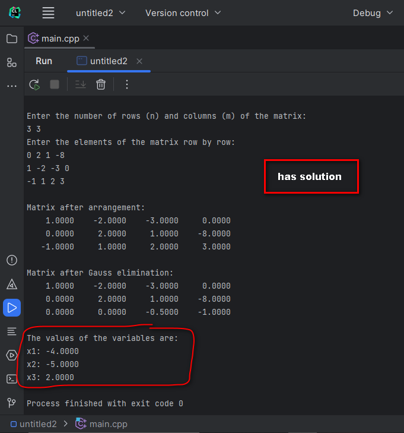
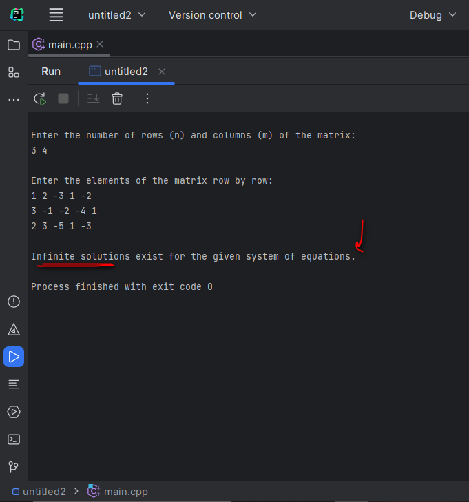
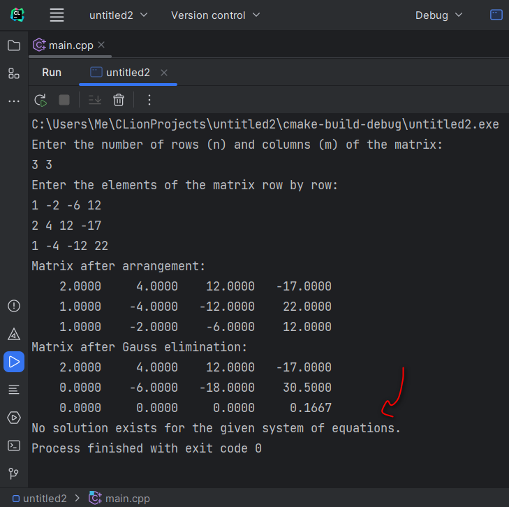

# Gaussian Elimination in C++

This project implements the **Gaussian Elimination** algorithm to solve systems of linear equations. The program reads a matrix from user input and performs Gaussian elimination to either find the solution, detect infinite solutions, or determine that no solution exists.

## Table of Contents
- [Overview](#overview)
- [Project Structure](#project-structure)
- [How it Works](#how-it-works)
- [Usage](#usage)
- [Example Outputs](#example-outputs)
- [Credits](#credits)

## Overview

Gaussian elimination is a method used in linear algebra to solve systems of linear equations. This program accepts the augmented matrix of a system, processes it using Gaussian elimination, and outputs the result accordingly.

### Features:
- **Multiple Outcomes**: Detects whether the system has a unique solution, infinite solutions, or no solution.
- **Matrix Size**: Supports matrices of size `n x m` where `n` is the number of equations and `m` is the number of unknowns.

## Project Structure

- `main.cpp` : Contains the code for solving the system of linear equations using Gaussian elimination.
- `README.md` : Project documentation.
- Images (explaining different cases with examples).

## How it Works

1. **Input**: 
   - First, the user inputs the matrix size (number of rows and columns).
   - Then, the augmented matrix (the system of equations) is entered row by row.
   
2. **Processing**:
   - Gaussian elimination is applied to reduce the matrix to upper triangular form.
   - The program checks for edge cases (infinite or no solutions).
   
3. **Output**:
   - If a unique solution exists, the values of the variables are calculated using back-substitution.
   - If infinite solutions exist or no solution exists, the program informs the user.

## Usage

1. **Input**:
   - The user enters the number of rows (`n`) and columns (`m`) of the matrix.
   - Then, the matrix is entered row by row, including the constants in the last column.

2. **Example Input**:
    ```bash
    Enter the number of rows (n) and columns (m) of the matrix: 
    3 3
    Enter the elements of the matrix row by row: 
    1 2 -1 8
    -2 -3 0 -11
    3 -1 2 3
    ```

3. **Output**:
   The program prints the solutions, or a message indicating if there are infinite or no solutions.

## Example Outputs

### 1. **Unique Solution Case**
   


### 2. **Infinite Solutions Case**
   


### 3. **No Solution Case**
   


## Credits

This project demonstrates an implementation of Gaussian elimination in C++ for solving linear systems of equations.

